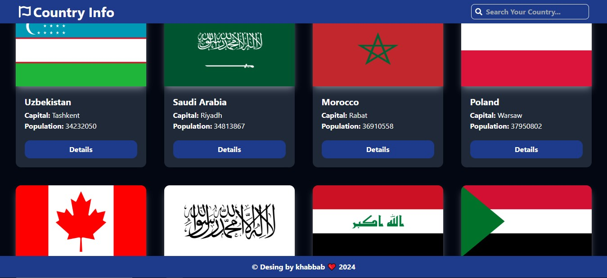

### assdi-batch-2-level-2-assignment-4-countries-app-khabbab50

# Welcome! 👋

Thanks for checking out this my project.

# 🚶‍♂️ About Me:

👨 I’m currently working on website development.  
👯 I’m looking to collaborate on website development and testing.  
🤝 I’m looking for help with developing and issue fixing.  
🌱 I’m currently learning javaScript, react.js, Tailwind CSS.  
💬 Ask me about web site design and development.  
⚡ Fun fact- i am lazy but smart .

# 👨‍💻 Where to find everything

Your task is to build out the project to the designs inside the `figma` fils. You will find both a mobile and a desktop version of the design.

The designs are in JPG static format. Using JPGs will mean that you'll need to use your best judgment for styles such as `font-size`, `padding`,`useState`,`margin`,`useEffect` and .

You will find all the required assets in the `/public/images` & `/src/assets/` folder. The assets are already optimized.

There is also a `figma file` containing the information you'll need, such as color palette and fonts.

# 📡 Technologies

- HTML
- CSS
- Tailwind CSS
- javaScript
- React.js
- React icons
- Country Rest API

